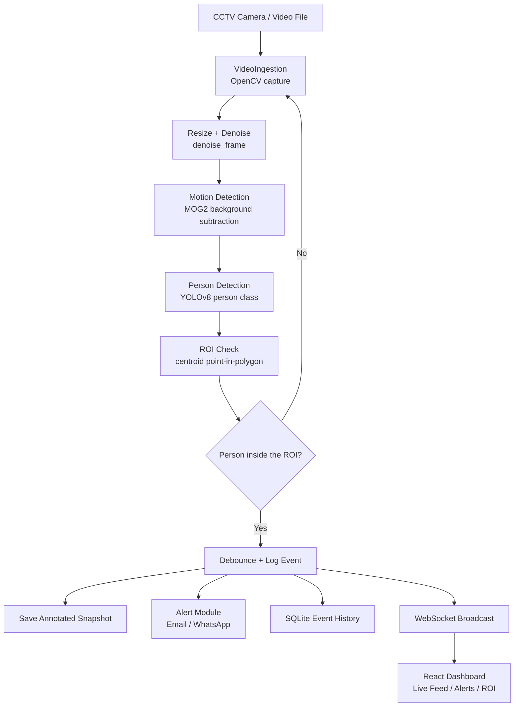
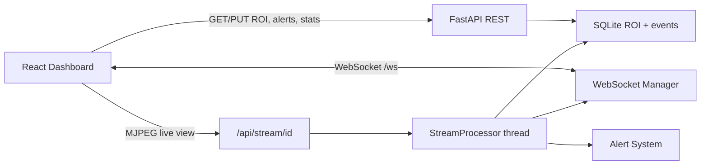

# Sentinel — AI-Powered CCTV Intrusion Detection System(WIP)

A real-time CCTV intrusion detection system that watches live or recorded camera
feeds, detects when a **person** enters a configured **region of interest (ROI)**, logs the
event with a timestamped snapshot, sends an alert, and exposes everything through a
**React web dashboard** (live feed, alert history, and ROI configuration).

The project is split into three layers:

1. **Video ingestion** — reads camera/video frames and cleans them up.
2. **Detection engine** — motion detection, YOLOv8 person detection, and ROI checks.
3. **Web backend + dashboard** — a FastAPI service that runs the pipeline headlessly
   and a React dashboard that visualizes it in real time.

---

## Table of Contents

- [Features](#features)
- [System Architecture](#system-architecture)
- [How the Pipeline Works](#how-the-pipeline-works)
- [Directory Structure](#directory-structure)
- [Libraries Used](#libraries-used)
- [Prerequisites](#prerequisites)
- [Installation](#installation)
- [Running the System](#running-the-system)
- [Dashboard](#dashboard)
- [REST API Reference](#rest-api-reference)
- [WebSocket Events](#websocket-events)
- [ROI Coordinate System](#roi-coordinate-system)
- [Alert Integrations](#alert-integrations)
- [Configuration](#configuration)
- [Validation / Testing](#validation--testing)
- [Troubleshooting](#troubleshooting)
- [Future Enhancements](#future-enhancements)

---

## Features

- **Live camera / video ingestion** (USB camera index or video file path).
- **Frame preprocessing** (resize + selectable denoising).
- **Motion detection** with OpenCV MOG2 background subtraction.
- **Person-only detection** with Ultralytics YOLOv8 (COCO `person` class).
- **Configurable ROI** — draw one polygon ROI from the dashboard and show/hide its overlay.
- **Point-in-polygon intrusion check** on each detected person's centroid.
- **Anomaly scoring** from the fraction of moving pixels inside the ROI.
- **Debounced alerts** (default: one alert per ROI every 30 seconds).
- **Evidence capture** — annotated snapshot saved for every alert.
- **Persistent history** — SQLite database of ROI and alert events.
- **Real-time dashboard** — live MJPEG feed, live alert feed, ROI editor.
- **Optional integrations** — email (Resend) and WhatsApp (UltraMsg).

---

## System Architecture



### Data-flow (FastAPI backend)



### ASCII overview (from the original design)

```text
 CCTV Camera  -->  Video Ingestion  -->  Frame Preprocessing
 (RTSP/USB)       (OpenCV/FFmpeg)      (resize, denoise)
                                              |
                                      Detection Engine
                                   - Motion Detection (MOG2)
                                   - Object Detection (YOLOv8 person)
                                   - ROI Check
                                              |
                     +------------------------+------------------------+
                     |                        |                        |
              Alert Module             Logging Module           Recording Module
           (Email/WhatsApp/SMS)       (SQLite: event/time)      (snapshot / clip)
                                              |
                                   Web Dashboard (React)
                                 - Live feed view
                                 - Alerts & history
                                 - ROI configuration
```

---

## How the Pipeline Works

For every captured frame, the backend processor:

1. **Read** a frame from a camera index or looping video file.
2. **Resize** it to a fixed processing width (`PROCESS_WIDTH`, default `960`).
3. **Denoise** it using `denoise_frame` (default method: `fast`).
4. **Motion detection** — apply the MOG2 background subtractor to get a binary
   motion mask.
5. **Person detection** — run YOLOv8 filtered to the `person` class every
   `DETECT_EVERY` frames (reusing the last result in between for smooth streaming).
6. **ROI mapping** — convert the dashboard ROI from normalized `100×60`
   coordinates into pixel coordinates for the current frame.
7. **Intrusion check** — for each detected person, test whether its bounding-box
   centroid is inside the ROI polygon.
8. **Anomaly scoring** — compute the fraction of moving pixels inside the ROI
   (reusing `extract_roi` and the MOG2 mask).
9. **Alert** — if a person is inside the ROI and the debounce window has
   passed, log the event, save an annotated JPEG snapshot, broadcast it over
   WebSocket, and optionally send email/WhatsApp.
10. **Stream** — encode the annotated frame as JPEG and publish it to the MJPEG
    live-feed endpoint.

---

## Directory Structure

```text
.
├── AlertSystem/                 # Notification integrations
│   ├── mail_alert.py            #   Resend email alert
│   ├── message_alert.py         #   SMS placeholder (MailerSend, commented)
│   └── whatsapp_alert.py        #   UltraMsg WhatsApp alert
├── Backend/                     # FastAPI service (connects pipeline to dashboard)
│   ├── __init__.py
│   ├── config.py                #   sources, ROI, detection/stream tuning
│   ├── store.py                 #   SQLite persistence (ROI + events)
│   ├── processor.py             #   headless per-camera detection thread
│   └── main.py                  #   REST + WebSocket + MJPEG endpoints
├── DetectionEngine/             # Core computer-vision pipeline
│   ├── background_model.py      #   YOLOv8 person-only detection
│   ├── motion_detection.py      #   MOG2 foreground / motion detector
│   ├── pretrianed_anomaly_detection.py  # anomaly scoring (FUVAS/motion fraction)
│   └── visualize_polyogn.py     #   ROI crop / polygon visualization
├── VideoIngestion/              # Input layer
│   ├── denoise.py               #   denoising helpers
│   └── video_input.py           #   original GUI-based ingestion runner
├── dashboard/
│   └── index.html               #   React + Tailwind dashboard (single file)
├── testVideo/                   # sample videos/images (git-ignored)
├── saved_videos/                # generated anomaly clips + snapshots (git-ignored)
├── data/                        # generated SQLite database (git-ignored)
├── yolov8n.pt                   # YOLOv8n weights (git-ignored)
├── .env                         # API keys (git-ignored)
├── requriments.txt              # Python dependencies
└── README.md
```


---

## Libraries Used

### Python

| Library | Version (tested) | What it is used for |
|---|---|---|
| [opencv-python](https://opencv.org/) | `5.0.0.93` | Video capture, frame resize, denoising, MOG2 background subtraction, polygon drawing, JPEG encoding. |
| [numpy](https://numpy.org/) | `2.4.6` | Numeric arrays for frames, masks, centroids, and image operations. |
| [ultralytics](https://docs.ultralytics.com/) | `8.4.129` | YOLOv8 person detection (`yolov8n.pt`). |
| [fastapi](https://fastapi.tiangolo.com/) | `0.141.1` | REST API + WebSocket server. |
| [uvicorn](https://www.uvicorn.org/) | `0.52.1` | ASGI server that runs FastAPI. |
| [pydantic](https://docs.pydantic.dev/) | (bundled with FastAPI) | Request/response validation models. |
| [python-dotenv](https://github.com/theskumar/python-dotenv) | `1.2.3` | Loads `.env` API keys. |
| [resend](https://resend.com/) | `2.42.0` | Email alert sending. |
| [requests](https://requests.readthedocs.io/) | `2.34.2` | HTTP calls to the WhatsApp (UltraMsg) API. |
| `sqlite3` (stdlib) | built-in | Persistent storage of the ROI and alert events. |
| `threading` (stdlib) | built-in | Per-camera detection threads, locks, and WebSocket fan-out. |

### Frontend (loaded via CDN, no build step)

| Library | What it is used for |
|---|---|
| [React 18](https://react.dev/) | Component-based UI (via UMD + Babel Standalone). |
| [ReactDOM 18](https://react.dev/) | Renders the app into the page. |
| [Tailwind CSS](https://tailwindcss.com/) | Utility-first styling. |
| [Babel Standalone 7](https://babeljs.io/) | Transforms in-browser JSX to `React.createElement`. |

> The dashboard is a **single HTML file** (`dashboard/index.html`). It uses the
> in-browser Babel transformer for development convenience; for production you
> would precompile the JSX with the Tailwind CLI / a proper React build.

---

## Prerequisites

- Python `3.10+` (developed and tested on `3.14`).
- A working `yolov8n.pt` weights file (present in the repo root).
- Network access for the CDN scripts (React, Tailwind, Babel) when opening the
  dashboard, and for the alert APIs when enabled.

---

## Installation

From the project root:

```bash
# 1. (Recommended) create and activate a virtual environment
python3 -m venv .venv
source .venv/bin/activate

# 2. install dependencies
pip install -r requriments.txt
```

If you are on Linux and `opencv-python` complains about GUI libraries, install:

```bash
sudo apt install libgtk2.0-dev pkg-config
```

Create a `.env` file with your alert credentials (see
[Alert Integrations](#alert-integrations)). The backend runs even without these
keys — alerts are simply not sent until they are configured and enabled.


---

## Running the System

Start the FastAPI backend from the project root:

```bash
python3 -m uvicorn Backend.main:app --host 0.0.0.0 --port 8000
```

Then open the dashboard:

- **Recommended:** http://localhost:8000/ (served by the backend, same origin).
- **Or:** open `dashboard/index.html` directly — it auto-detects
  `http://localhost:8000` for the API and falls back to offline/mock mode.

On startup the backend:

1. Creates/opens `data/sentinel.db`.
2. Creates the default ROI if no ROI is configured, and migrates an older
   multi-zone database by keeping its first polygon.
3. Registers the REST + WebSocket + MJPEG routes.

When you open the live view, a `StreamProcessor` thread starts for the single
configured camera and begins streaming annotated frames. Detected intrusions are written to
SQLite, saved as snapshots in `saved_videos/snapshots/`, and pushed to the
dashboard over WebSocket.

To stop the server, press `Ctrl+C`.

---

## Dashboard

Three pages are available in the sidebar:

| Page | What it does |
|---|---|
| **Live Feed** | Streams a camera with ROI/detection overlays. Includes a **Live Camera / Saved Video** toggle: **Live Camera** streams the webcam (`/api/stream/live`), **Saved Video** lets you pick any recorded clip from `saved_videos/` or `testVideo/`. Also shows camera status, ROI status, 24h detections, and average confidence. |
| **Alerts & History** | Live alert ticker + searchable/filterable history, with a button to mark each alert handled. |
| **ROI Config** | Draw one polygon ROI on a canvas, save it, or clear it. |

The dashboard automatically switches between **live mode** (backend reachable)
and **mock mode** (backend offline), so the UI still renders standalone.

---

## REST API Reference

Base URL: `http://localhost:8000`

| Method | Path | Description |
|---|---|---|
| `GET` | `/` | Serves the dashboard HTML. |
| `GET` | `/api/health` | Returns `{"status":"ok"}`. |
| `GET` | `/api/cameras` | The single configured camera with `status`, `fps`, `res`, `streaming`, and `stream` URL. |
| `GET` | `/api/stats` | `cameras_online`, `cameras_total`, `roi_configured`, `detections_24h`, `avg_confidence`. |
| `GET` | `/api/roi` | Get the configured ROI, or `null`. |
| `PUT` | `/api/roi` | Replace the ROI. Body: `{"color", "pts": [[x,y], ...]}`. |
| `PATCH` | `/api/roi/visibility` | Show or hide the ROI overlay. Body: `{"visible": true}`. Detection remains active when hidden. |
| `DELETE` | `/api/roi` | Clear the ROI. |
| `GET` | `/api/alerts` | Alert history. Optional query params: `limit`, `type`, `q`. |
| `PATCH` | `/api/alerts/{event_id}` | Mark an alert handled. Body: `{"handled": true}`. |
| `GET` | `/api/retention` | Get automatic alert-history cleanup settings. |
| `PUT` | `/api/retention` | Set cleanup. Body: `{"enabled": true, "amount": 7, "unit": "days"}`. Only events older than the selected age are deleted. |
| `GET` | `/api/videos` | List saved/recorded videos available for playback. |
| `GET` | `/api/stream/live` | MJPEG stream from the live camera (OpenCV device `0`). |
| `GET` | `/api/stream/video/{video_id}` | MJPEG stream of a saved video by its id from `/api/videos`. |
| `GET` | `/api/stream/{camera_id}` | MJPEG live feed of a configured camera (`multipart/x-mixed-replace`). |

Interactive docs are available at **http://localhost:8000/docs** (Swagger UI).

---

## WebSocket Events

Endpoint: `ws://localhost:8000/ws`

On connect, the server immediately sends the current `roi` and `stats`. After
that it pushes events as they happen:

| Type | Payload | Trigger |
|---|---|---|
| `alert` | `{ "data": { id, cam, roi, time, conf, type, handled, ... } }` | New intrusion event. |
| `roi` | `{ "data": { id, name, color, visible, pts } }` or `null` | ROI saved, visibility changed, or cleared. |
| `stats` | `{ "data": { ...stats } }` | Stats changed (after alert/ROI change). |

---

## ROI Coordinate System

The dashboard's ROI editor uses a normalized `100 × 60` coordinate space
(matching the SVG `viewBox="0 0 100 60"`). The backend stores those same
normalized points and converts them to pixels at detection time:

```text
pixel_x = round(pt_x / 100 * frame_width)
pixel_y = round(pt_y / 60  * frame_height)
```

This keeps the ROI resolution-independent: the same ROI definition works for
different camera/video resolutions.


---

## Alert Integrations

Alert sending is **opt-in** to avoid spamming real recipients while developing.

Enable it:

```bash
export ENABLE_ALERTS=1
```

Or add `ENABLE_ALERTS=1` to `.env`; the backend loads `.env` at startup.

Then set the recipients/credentials in `.env`:

```dotenv
# Email via Resend
ENABLE_ALERTS=1
RESEND_API = "your_resend_api_key"
ALERT_MAIL_FROM = "onboarding@resend.dev"
ALERT_MAIL_TO = "you@example.com"

# WhatsApp via UltraMsg
WHATSAPP_API = "your_ultramsg_token"
ALERT_WHATSAPP_TO = "+911234567890"
```

Modules used:

- `AlertSystem/mail_alert.py` — sends an HTML email through Resend.
- `AlertSystem/whatsapp_alert.py` — sends a WhatsApp message through UltraMsg.
- `AlertSystem/message_alert.py` — SMS placeholder (MailerSend example, commented out).

If the relevant env vars are missing or `ENABLE_ALERTS != 1`, the backend simply
logs the event without sending anything.

---

## Configuration

All tuning values live in `Backend/config.py`.

### Single camera source (`SOURCES`)

The application uses one configured camera entry:

```python
{
    "id": "cam-01",
    "name": "Perimeter Gate",
    "kind": "video",          # "video" (file path) or "camera" (device index)
    "source": "/abs/path/to/file.mp4",  # or 0 for the first USB webcam
    "enabled": True,          # False marks the camera offline
    "fps": 14,
    "res": "1080p",
}
```

### Live camera & saved videos

| Setting | Default | Meaning |
|---|---|---|
| `LIVE_CAMERA_INDEX` | `0` | OpenCV device index used by the **Live Camera** toggle. |
| `VIDEO_DIRS` | `saved_videos/`, `testVideo/` | Folders scanned for the **Saved Video** dropdown. |
| `VIDEO_EXTENSIONS` | `.mp4`, `.avi`, `.mov`, `.mkv` | File types listed in the dropdown. |

### Detection / streaming tuning

| Setting | Default | Meaning |
|---|---|---|
| `PROCESS_WIDTH` | `960` | Frames are downscaled to this width before inference. |
| `DETECT_EVERY` | `3` | Run YOLO every N frames (motion runs every frame). |
| `PERSON_CONF_THRESHOLD` | `0.35` | Minimum YOLO confidence for a valid person. |
| `ANOMALY_THRESHOLD` | `0.02` | Motion fraction inside the ROI that counts as anomalous. |
| `ALERT_DEBOUNCE_SECONDS` | `30` | Minimum seconds between ROI alerts. |
| `ALERT_CONFIDENCE_THRESHOLD` | `0.75` | Email/WhatsApp notifications require confidence strictly greater than 75%. |
| `STREAM_FPS` | `12` | Target processing/streaming rate. |
| `JPEG_QUALITY` | `70` | MJPEG frame quality. |

### Default ROI (`DEFAULT_ROI`)

Seeded into SQLite on first run. You can edit it in the dashboard instead.

---

## Validation / Testing

Verified while developing the backend:

- `python3 -m py_compile Backend/*.py` — all modules compile.
- Booted Uvicorn and smoke-tested `/`, `/api/health`, `/api/cameras`,
  `/api/roi`, `/api/stats`, and `/api/alerts`.
- Confirmed `/api/stream/cam-01` returns valid `image/jpeg` MJPEG frames.
- Confirmed ROI save/clear and alert `PATCH` round-trips.
- Confirmed the dashboard renders with **"Backend connected"** when served by
  FastAPI, and **"Backend offline"** (mock mode) when the backend is stopped.

You can also run the standalone pipeline modules directly:

```bash
# Person detection on a single frame
python3 DetectionEngine/background_model.py testVideo/hit_and_run.mp4

# Original GUI ingestion runner (select ROI with mouse, 's' to save)
python3 VideoIngestion/video_input.py
```

---

## Troubleshooting

- **Dashboard is blank / console shows `Cannot use import statement outside a module`**
  The dashboard is pinned to Babel Standalone 7 (classic JSX runtime). Clear the
  browser cache or re-fetch the page.

- **`Backend offline` in the dashboard**
  The FastAPI server is not running. Start it with
  `python3 -m uvicorn Backend.main:app --port 8000`.

- **Live feed shows black / no frames**
  Check that the camera's `source` path exists and is readable, and that the
  camera is `"enabled": true` in `Backend/config.py`.

- **YOLO/`ultralytics` import error**
  Install dependencies with `pip install -r requriments.txt` and ensure
  `yolov8n.pt` is in the project root.

- **Email/WhatsApp not arriving**
  Alerts are disabled unless `ENABLE_ALERTS=1`. Also verify the `.env` keys and
  recipient variables.

---

## Future Enhancements

- Multi-object tracking (DeepSORT) to follow intruders across frames/cameras.
- Loitering / running / climbing behavior classification.
- Face recognition whitelist for authorized personnel.
- RTSP/IP-camera discovery and auto-reconnect.
- TensorRT / ONNX export for faster edge inference.
- Precompiled React build instead of the in-browser Babel transformer.
- Docker Compose packaging.
